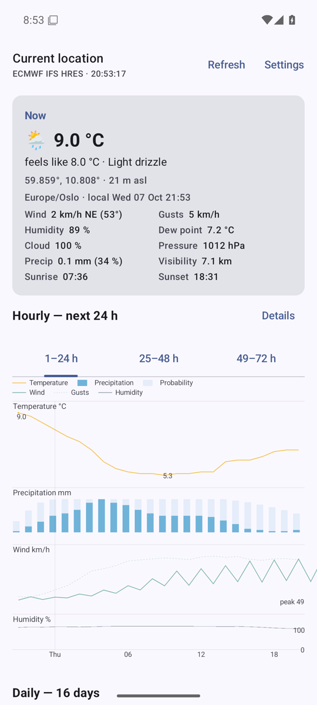
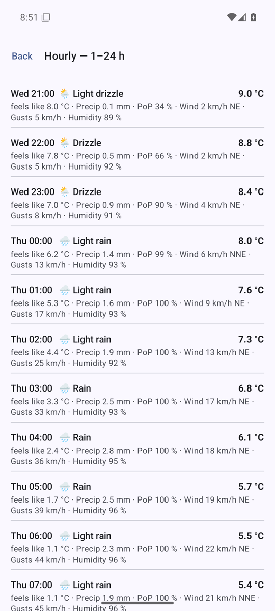
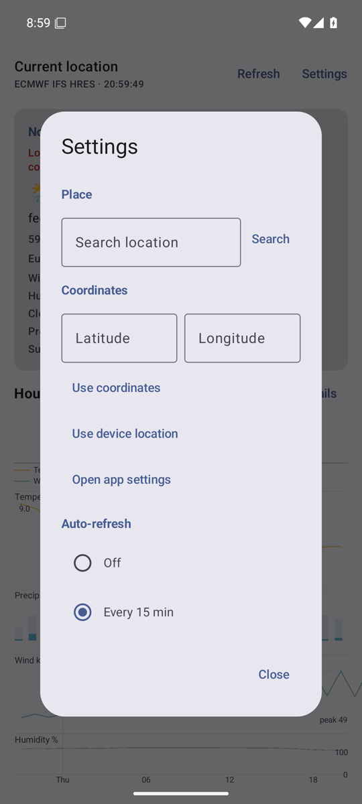
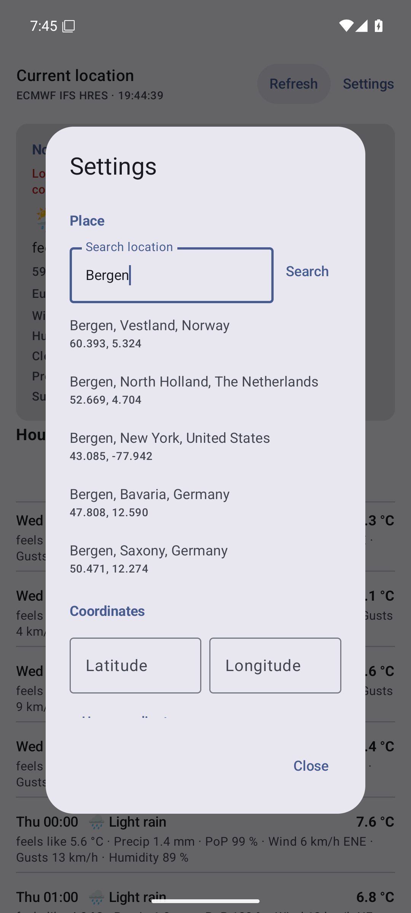

# Halcyon


Kotlin/Jetpack Compose client for the [Open-Meteo](https://open-meteo.com/) forecast API, using the
**ECMWF IFS HRES** model at its native ~9 km resolution. A port of the terminal `weather-tui`
project, with device location in place of a `--lat/--lon` flag.

Data © ECMWF / Open-Meteo, [CC-BY 4.0](https://open-meteo.com/en/license). Open-Meteo is open
source and needs no API key; the free tier allows on the order of 10,000 requests a day, which this
app stays far below. Independent client, not affiliated with Open-Meteo.

## Screenshots

<p>
  
  
  
  
</p>

## What it shows

* **Location** from the device. When the permission is denied or no fix arrives, the app opens its
  fallback: search a city, whose coordinates come back from the public geocoding API, or type
  latitude and longitude by hand.
* **Current conditions** for that position: temperature, apparent temperature, weather,
  wind and gusts, humidity, dew point, cloud cover, pressure, precipitation and probability,
  visibility, sunrise and sunset.
* **Hourly**: a chart for each of the next three 24-hour spans (`1–24 h`, `25–48 h`, `49–72 h`) — temperature, precipitation, wind and humidity on one shared time axis, with the table behind each chart one tap away.
* **Daily**: the next 16 days.
* **Refresh**: a timer fetches a fresh response every 15 minutes by default — configurable from 15 minutes to 3 hours, or off — and a 1 h response cache spares the other loads (cold start, place or model change) from repeating requests.
* SI units only — °C, km/h, mm, km — refreshed every 900 s while the screen is visible, with an
  on-disk response cache (1 h TTL).

## Build

Requires a JDK 17–26 (Gradle 9.6 refuses JDK 27) and an Android SDK with
`platform-tools`, `platforms;android-37.2` and `build-tools;36.0.0`. Android Studio or the
standalone `sdkmanager` both work; no root access is needed.

```bash
./gradlew :app:assembleDebug          # app/build/outputs/apk/debug/app-debug.apk
./gradlew :app:assembleRelease        # app/build/outputs/apk/release/app-release.apk
./gradlew :app:testDebugUnitTest      # 71 unit tests, no device required
```

Release builds are minified with R8. Signing reads `keystore.properties` (never committed, see
`.gitignore`); without it the build falls back to the debug key, so `app-release.apk` is always
installable.

Two settings are per-machine and never tracked: `local.properties` (`sdk.dir`) and the JDK choice.
Put a JDK 17–26 on `JAVA_HOME`, or pin one with `org.gradle.java.home` in
`~/.gradle/gradle.properties`. AGP 9 provides built-in Kotlin, so the module applies only
`com.android.application` and the Compose compiler plugin; that plugin must match the Kotlin Gradle
plugin AGP bundles.

| Component | Version | Constraint |
| --- | --- | --- |
| AGP | 9.4.1 | needs Gradle ≥ 9.6 |
| Gradle | 9.6.0 | matches AGP 9.4 |
| JDK | 21 | AGP needs ≥ 17; Gradle supports ≤ 26 |
| Kotlin | 2.2.10 | bundled by AGP 9.4.1; Compose compiler must match |
| Compose BOM | 2026.09.00 | Material 3 |
| compileSdk / targetSdk / minSdk | 37.2 / 36 / 26 | 37.2 is the floor of the newest AndroidX and OkHttp artifacts; `java.time` needs 26 |

## Run

```bash
avdmanager create avd -n weather36 -k "system-images;android-36;google_apis;x86_64" -d pixel_7
$ANDROID_HOME/emulator/emulator -avd weather36 -no-snapshot &
adb wait-for-device
adb emu geo fix 10.7522 59.9139       # emulator order is longitude, latitude
adb install -r app/build/outputs/apk/debug/app-debug.apk
adb shell am start -n dev.meteo.weather/.MainActivity
adb exec-out screencap -p > screenshot.png
```

Use a `google_apis` image: the fused provider needs Play services, and an injected fix is how a
device position is simulated.

## Architecture

```
app/src/main/java/dev/meteo/weather/
├── data/
│   ├── model/                Forecast, Hour, Day, Place            ← api.py dataclasses
│   ├── OpenMeteo.kt          endpoints, model ids, variable lists   ← api.py constants
│   ├── OpenMeteoApi.kt       OkHttp client, request contract        ← api.py HTTP
│   ├── ForecastParser.kt     tolerant payload parsing               ← api.py parsing
│   ├── ResponseCache.kt      JSON-on-disk TTL cache                 ← api.py ResponseCache
│   ├── ForecastRepository.kt horizon and cache policy
│   ├── RefreshInterval.kt    auto-refresh choices
│   └── SettingsStore.kt      model id, refresh interval, last place
├── domain/                   Wmo, Formatters, Si, HourlyPages, ChartBand,
│                             HourlyChartData, CoordinateInput       ← wmo.py + render.py, pure
├── location/                 LocationProvider, LocationFix, Permissions
└── ui/                       WeatherScreen, WeatherViewModel, UiState, components/
```

* **Rendering is pure.** Everything in `domain/` is a function of a parsed `Forecast`, so it is
  unit tested on the JVM without a device — the property the Python renderers had.
* **Requests never block the UI.** They run on `Dispatchers.IO`; a newer request cancels the
  previous one, so a slow response cannot overwrite a fresh one. `UiState.visibleForecast` hides a
  forecast whose place no longer matches the selection.
* **Location is provider-agnostic.** `LocationProvider` prefers an active fix from the fused
  provider, falls back to the framework `LocationManager` (no Play services, or GrapheneOS with
  sandboxed Play, where the OS reroutes the fused provider to its own implementation), and treats a
  cached fix as a placeholder. Candidates are compared by monotonic timestamp, never by provider
  name. The device position is the primary source; when the permission is denied or no fix
  arrives, the app opens its settings sheet so a city can be searched or coordinates typed
  by hand, meanwhile showing the saved place, and Oslo (`59.9139, 10.7522`) before that.
* **Formatting matches CPython.** `Fmt.num` rounds with `BigDecimal` HALF_EVEN on the exact binary
  value, so it agrees with Python's `f"{value:.1f}"` where `String.format` would round half up.

Query contract, matching the TUI: `models=ecmwf_ifs`, `forecast_days=16`, `timezone=auto`,
coordinates rounded to six decimals, the same 17 hourly and 17 daily variables.

## Parity with weather-tui

| weather-tui | Halcyon |
| --- | --- |
| `models=ecmwf_ifs`, 17 + 17 variables | identical query and variable lists |
| `--lat/--lon` | device fix, rounded like `round(lat, 6)`; manual entry as the fallback |
| `--city NAME` | in-app search, same geocoding API; results show the coordinates it returns |
| default Dublin | Oslo, when there is no fix and no saved place |
| `--days 1..16` | fixed 16 days; the hourly section covers the first 72 h |
| `--hourly-rows 24` | three charted pages of 24 h |
| `--units` / `u` | dropped: SI only, so there is no unit-system abstraction |
| `--refresh 900` / `r` | 900 s timer by default, configurable (15 min–3 h or off), plus an explicit refresh |
| `--cache-ttl 3600` / `--no-cache` | 1 h TTL; a refresh bypasses it on read |
| `q` | system back gesture |
| Now panel | `Now` card, field for field |
| hourly table | a chart per page; the table is the details screen behind it |
| daily table | 16 daily rows, two lines each |

Deliberate differences beyond units: the tables are two-line rows rather than 9-column tables,
because a phone cannot show nine columns; the requested position is not repeated on screen, so the
card shows the response's own grid-snapped coordinates; `uv_index_max` appears only when the model
returns it, which the 9 km IFS model never does. Fields the TUI fetched but never rendered (`rain`,
`showers`, `snowfall`, `boundary_layer_height`, `daylight_duration`, `precipitation_hours`,
`apparent_temperature_max`) are still fetched and parsed, and still not rendered.

## Tests

`./gradlew :app:testDebugUnitTest` — 71 tests in 13 classes, fully offline.

Behaviour covered: payload parsing and its tolerance paths (missing, short, non-numeric, boolean,
numeric-string and null columns, unparsable timestamps), the request query and its clamping, error
payload and HTTP failure handling, response caching with its TTL and key derivation, number and
date formatting, WMO codes and the compass, hourly paging boundaries, SI conversion and the UI
state's place matching, manual coordinate entry with its boundaries, and the chart band scaling.
HTTP behaviour runs
against a local `com.sun.net.httpserver` instance: no mock-server dependency, no network.

## Licence

MIT (see [LICENSE](LICENSE)), like the terminal version. Forecast data is provided by ECMWF and
Open-Meteo under CC-BY 4.0.
